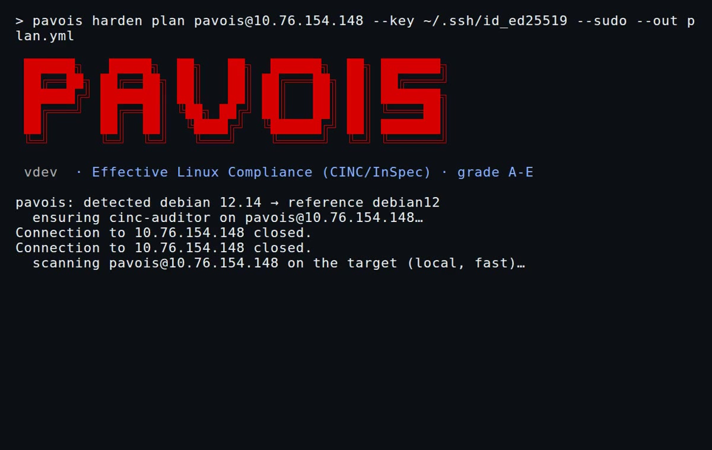

<p align="center">
  
</p>

<p align="center">
  <b>Effective Linux compliance &amp; hardening, over CINC / InSpec</b><br/>
  <sub>Audits the configuration your services <i>actually run</i> (<code>sshd -T</code>, <code>sysctl</code>, <code>systemctl</code>, <code>auditctl</code>), not just the files on disk. Maps each control to every standard that covers it (CIS, ANSSI BP-028, NIST, PCI-DSS, STIG), grades it <b>A–E</b>, and hardens it as code.</sub>
</p>

<p align="center">
  <a href="https://securityscorecards.dev/viewer/?uri=github.com/stephrobert/pavois"></a>
  &nbsp;&nbsp;
  <a href="https://slsa.dev/spec/v1.0/levels"></a>
  &nbsp;&nbsp;
  <a href="https://score.getplumber.io/github.com/stephrobert/pavois"></a>
</p>

<p align="center">
  <a href="https://github.com/stephrobert/pavois/actions/workflows/release.yml"></a>
  <a href="https://github.com/stephrobert/pavois/releases"></a>
  
  
  <a href="LICENSE"></a>
</p>

<p align="center">
  <a href="https://pavois.dev">Website</a> •
  <a href="https://pavois.dev/en/handbook/">Handbook</a> •
  <a href="https://pavois.dev/en/rules/">Controls</a> •
  <a href="https://pavois.dev/en/downloads/">OSCAL</a> •
  <a href="https://github.com/stephrobert/pavois/issues">Issues</a>
</p>

---

## 🛡️ What is Pavois?

Pavois is a Linux **compliance scanner and hardening tool** built on **CINC Auditor** (the
open-source build of Chef InSpec). It competes with OpenSCAP and Lynis, with one decisive
difference: it audits the **effective configuration** of a running host, not the text of files.

- **Effective, not file-based.** A control on a service reads the resolved state: `sshd -T`,
  `sysctl`, `systemctl show`, `auditctl -l`. It catches the `Include`s and drop-ins a file read
  misses, where a permissive override silently defeats a stricter main config.
- **One check, every standard.** A single effective-config assertion carries all its mappings:
  **CIS**, **ANSSI BP-028**, **NIST** (800-53 / 800-171), **PCI-DSS** and **DISA STIG**. One
  neutral control, every applicable mapping, never a duplicated rule.
- **A–E grade, opposable.** A published scoring formula (failure-weighted, critical-capped),
  computed identically in the CLI and the HTML report.
- **Harden as code.** `pavois harden` plans the fixes, you opt in per rule, and a native Chef run
  converges them. No blind shell script.
- **A qualified verdict.** A PASS states what it proves: **running now** vs **reboot-survivable**.
  A runtime-only pass caps the grade under A until persistence is proven. See [the qualified
  verdict](https://pavois.dev/en/handbook/qualified-verdict/).
- **Agentless.** Runs `cinc-auditor` natively over `local`, `ssh://` or `docker://` targets, using
  your own `~/.ssh/config`. No agent on the target.

<p align="center">
  <a href="https://pavois.dev"></a>
</p>

## 🚀 Quick start

**Today, build from source (Option B).** The verified release binary (Option A) ships with the
first public release; until then there is no downloadable artifact (see `feature-status`).

### Option A — a verified release binary (planned: first release)

Once the first release is published, each release will ship a static binary per platform plus
`checksums.txt`. Download it, check integrity, and verify it was built by the release pipeline:

```bash
gh release download v0.1.0 --repo stephrobert/pavois \
  --pattern 'pavois-linux-amd64' --pattern 'checksums.txt'
sha256sum --ignore-missing --check checksums.txt
gh attestation verify pavois-linux-amd64 --repo stephrobert/pavois   # SLSA build provenance
chmod +x pavois-linux-amd64 && ./pavois-linux-amd64 version
```

### Option B — build from source

The repository ships the **source of truth only** (`docs/reference/rules.yml` + the enriched site
content). The InSpec corpus (`.rb`) and the OSCAL bundle are **derived artifacts**: they are not
committed, they are regenerated from the reference. So a from-source setup is build, then regen:

```bash
git clone https://github.com/stephrobert/pavois.git
cd pavois
mise trust && mise install   # pinned Go / Node / Python toolchain
mise run build               # compile the binary -> go/pavois
mise run regen               # rebuild the rule corpus + OSCAL from docs/reference/
```

`mise run regen` runs `gen` (rules.yml → per-OS reference) → `render` (→ the `.rb` corpus the
scanner executes) → `oscal` (→ the OSCAL bundle). CINC Auditor itself installs natively on the
first scan (via omnitruck); a Docker container is the fallback.

## ⚙️ How it works

```bash
# 0. Check the environment is ready (CINC engine, sudo, SSH, OS, rule corpus)
pavois doctor

# 1. Audit a host (effective config needs sudo; the OS profile is auto-detected)
pavois scan user@host --key ~/.ssh/id_ed25519 --sudo

# 2. Plan the fixes, opt in per rule, converge a native Chef run, re-scan
pavois harden plan user@host --key ~/.ssh/id_ed25519 --sudo
#    edit the plan: flip rules to `apply: true`
pavois harden apply hardening-plan-debian12.yml --reboot --scan

# 3. Build a before/after campaign report (grade delta + transition matrix)
pavois diff before.json after.json --html campaign.html --json campaign.json

# 4. Package audit-ready evidence (before/after, plan, reports, manifest + checksums)
pavois bundle before.json after.json --plan hardening-plan-debian12.yml --report campaign.html

# 5. Serve the HTML reports
pavois serve   # http://localhost:8098
```

The scan prints the deviations by severity and the **A–E grade**, and writes an HTML report. With
`--reboot`, harden reboots the target and re-scans, so a pass in that report is **reboot-proven**; it
also writes a **reboot-proof artifact** (the boot_id before and after, proving the re-scan ran on a
fresh boot) that you can fold into the evidence bundle (`bundle --reboot-proof`).
`--format sarif|junit|json|csv|html` and `--fail-under <points>` make the grade a CI gate.

Every scan also prints a **posture breakdown** by remediation class (`auto`, `manual`, `dangerous`,
`install-time`, `kernel-build`) and a **remediable posture grade**, the A–E formula recomputed over
only the controls fixable on a running host (it excludes install-time and kernel-build), so an
unfixable separate partition or a kernel `CONFIG_*` does not mask what you can actually remediate.

`pavois diff` turns two scans into a **campaign report**: the grade delta plus the full transition
matrix (failed → passed, newly-applicable, still-failing, and any **regressions**). It shows every
control's before/after state, so a result cannot be dismissed as a moved denominator when the
baseline widens the applicable set. `--html` writes a self-contained report; `--json` the structured
delta for an evidence bundle.

`pavois bundle` packages a campaign into a tamper-evident **evidence bundle**: the before/after scans,
the plan that was applied, the reports, the reboot proof, the transition delta, plus a `manifest.json`
(tool + ruleset version, **pavois binary digest**, target, grade delta) and a `checksums.txt`. You then
**sign `checksums.txt` with your own identity** (`cosign sign-blob` or `gpg --detach-sign`) — pavois does
not own the signing key, the auditor's trust is in your KMS/OIDC identity. **`pavois bundle verify <dir>`**
re-checks every artifact's SHA-256, the manifest digest, and the signature if present (exit non-zero on
any tampering; `--require-signature` to also fail when unsigned), turning the package into opposable,
audit-ready evidence.

| Command | Does |
|---------|------|
| `scan` | Audit a target's effective config, grade A–E |
| `harden plan` / `apply` | State-aware Chef hardening, opt-in per rule, `--reboot --scan` |
| `diff` | Before/after campaign report: transition matrix, regressions, grade delta (`--html` / `--json`) |
| `bundle` / `bundle verify` | Package audit-ready evidence (scans + plan + reports + manifest + checksums), then verify integrity + signature |
| `verify` | Behavioral check: attempt the forbidden action, confirm the protection holds |
| `oscal` | Publish the baseline as OSCAL (catalog + per-OS profiles) |
| `serve` | Browse the HTML reports |

## 📐 One check, every standard

Each control declares the evidence it gathers and maps to where every standard places the
requirement. A mapping is an anchored, cross-validated **cross-reference**, not a claim of
equivalence. Browse the [control explorer](https://pavois.dev/en/rules/) and the per-standard
views: [CIS](https://pavois.dev/en/standards/cis/) · [ANSSI BP-028](https://pavois.dev/en/standards/bp28/)
· [NIST](https://pavois.dev/en/standards/nist/) · [PCI-DSS](https://pavois.dev/en/standards/pci-dss/)
· [STIG](https://pavois.dev/en/standards/stig/).

## 🔒 Supply chain

Pavois holds itself to the posture it audits:

- **SLSA build provenance** on every release binary (`actions/attest-build-provenance`); verify
  with `gh attestation verify`.
- **OpenSSF Scorecard** on the repository.
- **Plumber-validated CI** — our own workflows are scanned by [Plumber](https://getplumber.io)
  against a trust policy (`.plumber.yaml`): actions pinned by commit SHA, least-privilege
  permissions, no dangerous triggers, no `write-all`, CVE / archived-action checks.
- **Trivy dependency audit** (pinned) over the Go and npm locks; a fixable HIGH/CRITICAL blocks CI.
- **14-day dependency quarantine** — Dependabot `cooldown` delays adopting a new dependency version
  until it has aged 14 days (security fixes bypass it).

## 📦 OSCAL

The control catalogue is published as **OSCAL 1.1.2** (catalog + per-OS profiles), consumable by
any OSCAL-aware GRC tool. Each control carries its evidence type and the qualified verdict
(`proves-running` / `proves-persistent` / `proves-reboot-survivable`). It is a derived artifact:
`mise run oscal` regenerates it. See [Downloads](https://pavois.dev/en/downloads/).

## 🗺️ Coverage

Pavois audits the effective configuration of a running Linux host across 8 OS families, and is
explicit about its edges: some domains (firewall ruleset, log forwarding, MAC policy depth) are
shallow today. The honest [coverage matrix](https://pavois.dev/en/handbook/coverage/) names what is
deep and what is not.

## 🤝 Contributing

The **rule library** is where the project most needs help — **[CONTRIBUTING.md](CONTRIBUTING.md)**
has a "Where to help" table mapping each intent (add a rule, deepen a thin domain, add an OS, source
a mapping…) to a concrete action. How the code fits together: **[ARCHITECTURE.md](ARCHITECTURE.md)**.
By participating you agree to the **[Code of Conduct](CODE_OF_CONDUCT.md)**. Report security issues
privately via **[SECURITY.md](SECURITY.md)**.

## 📄 License & attribution

Apache-2.0 (see [LICENSE](LICENSE)). Control definitions derive from
[ComplianceAsCode/SSG](https://github.com/ComplianceAsCode/content) (BSD-3) and are cross-validated
against ansible-lockdown. CIS Benchmarks, PCI DSS, STIG and NIST are trademarks of their respective
owners; Pavois is not affiliated with or endorsed by them. NIST/STIG content is U.S. Government
public domain.
